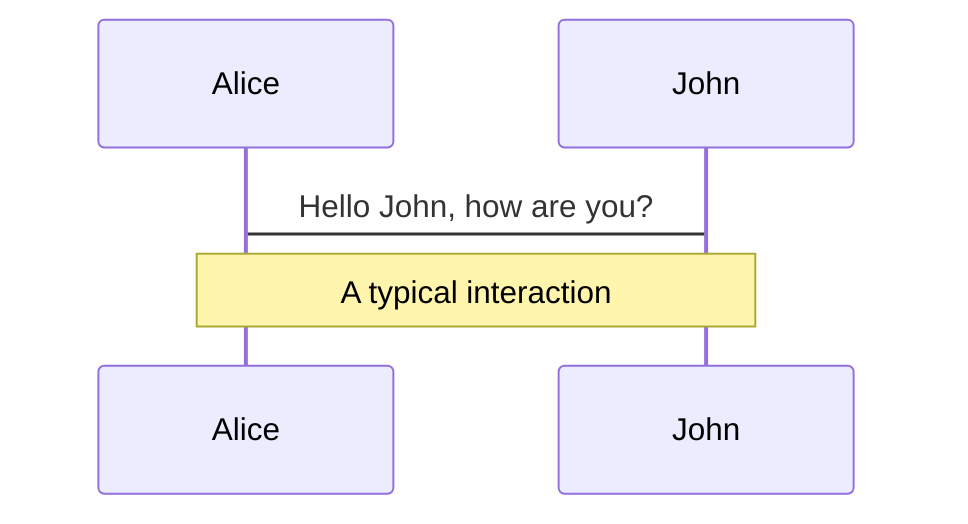

# Slidev

This is the cover page.

---
layout: center
background: './images/background-1.png'
class: 'text-white'
---​

# Page 2

This is a page with the layout `center` and a background image.


---

# Page 3

This is a default page without any additional metadata.
Hello

---


# page 4
## This is Red

<style>
h1 {
  color: red
}
</style>

---


# page 5
# Next slide is not affected

---


# page 6

图片插入

``` shell
如果是本地资源，请将资源放置到 public 文件夹 中并使用 / 开头的 URL 来引用它们。
```

1. 远程图片
 

---


# page 7

2. 本地图片
   


---


# page 8

**自定义尺寸或样式**


---


# page 9
图标的使用

<!-- <logos-vue /> -->
---


# page 10

---
layout: two-cols
---

<template v-slot:default>

# Left

This shows on the left

</template>
<template v-slot:right>

# Right

This shows on the right

</template>

---


# page 11:使用语法糖实现分栏

---
layout: two-cols
---

# Left

This shows on the left

::right::

# Right

This shows on the right

---


# 公式

## Test  Crossline Formular:
$$
\sum_{i=1}^{+\infty}{\frac{1}{i^2}} = \frac{\pi^2}{6}
$$

## Test MutipulLine Formular:
下面就是一个用于测试的多行公式
$$
\begin{aligned}    
E &=(a+b)(a-b)+b^2\\ 
  &=a^2-b^2+b^2 \\
  &=a^2
\end{aligned}
$$

---


# 图表

你也可以在 Markdown 的文本描述中创建图形或图表，得益于 Mermaid。
被标记为 mermaid 的代码块将被转换为图形，例如：



---


# page 12
