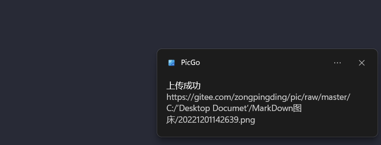
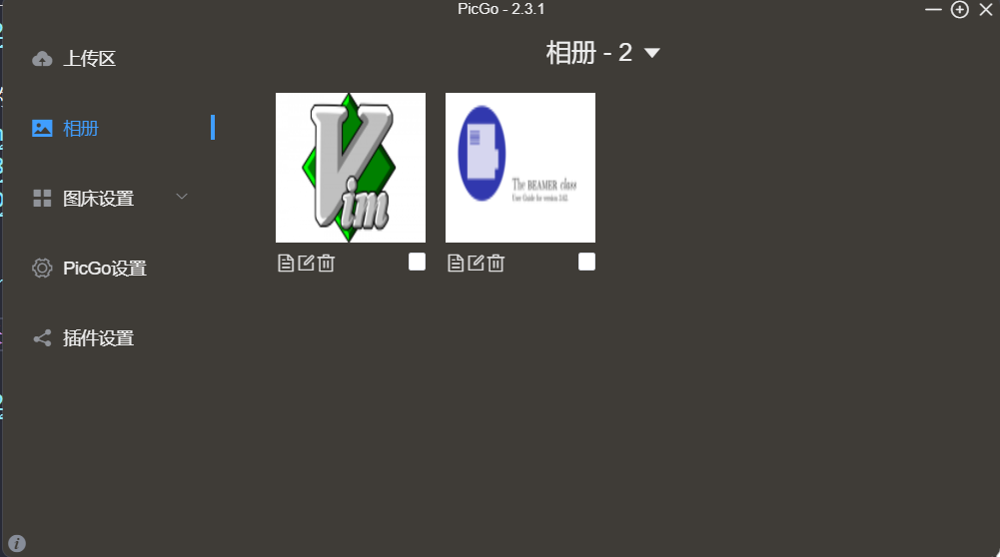
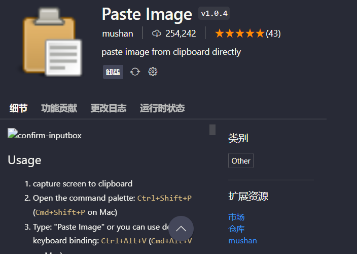

# 一：PicGo图床测试

> 快捷键 Ctrl + Alt + P

## 3. 第一次测试

显示上传成功后会出现如下的画面

生成的图片如图:

也可以去Picgo的软件界面查看图床信息:如下

## 1. gitee官网复制的图片

## 2. Picgo生成的连接

# 二：使用vscode插件实现复制粘贴

> 快捷键Ctrl + Alt + V$$

> 原理：这个插件会把你剪切板里面的内容自动保存到当前的文件夹下.

