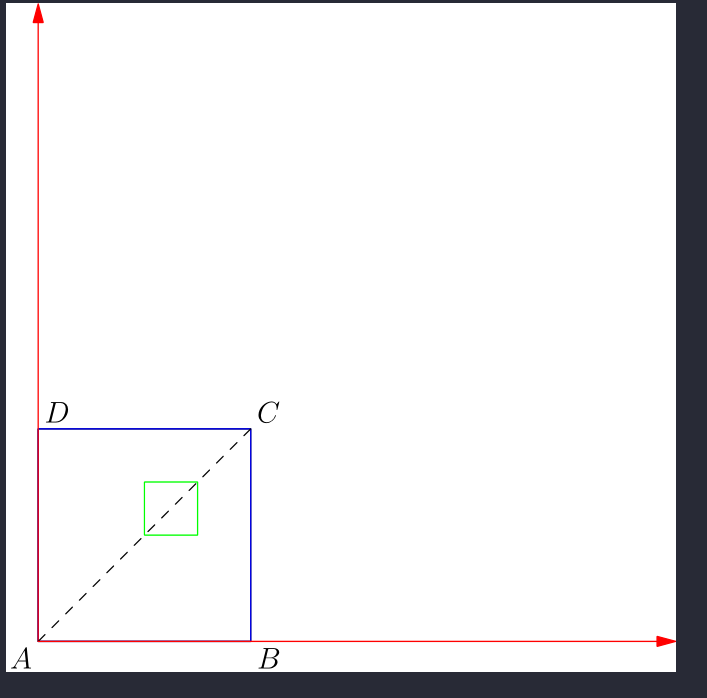
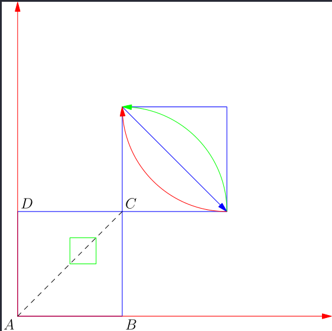

# 1. 了解Asymptote

## 1.1 batch mode：把代码写入一个文件

直接在windows terminal中输入asy <FileName>即可打开GSView生成eps文件

还有很多的可选参数，以下即为使用样例:

``` shell
 $ asy -V -f pdf Hello
 $ asy
> draw((0, 0)--(2cm, 2cm))
> draw((2cm, 0)--(0, 2cm));
> draw((2cm, 0)--(0, 2cm));
> settings.outformat = "pdf";
> draw((2cm, 0)--(0, 2cm));
> draw((0, 1cm)--(1cm, 1cm))
> draw((1cm, 0)--(2cm, 2cm), red);
> draw((1cm, 0)--(2cm, 2cm), red);
> draw((0, 0)--(2cm, 2cm));
```

# 2. 配置:
## 2.1 配置环境变量

设置pseviwer的环境变量:

变量名：ASYMPTOTE_PSVIEWER

变量值："C:\Users\PC\AppData\Local\SumatraPDF\SumatraPDF.exe"


## 2.2 写入config.asy文件(部分内容如下)

``` shell
import settings;
// GhostScript的解析路径
gs="C:\Users\PC\scoop\apps\ghostscript\10.0.0\bin\gswin32\gswin32c.exe";
// 设置默认的eps查看方式
psviewer="C:\Users\PC\AppData\Local\SumatraPDF\SumatraPDF.exe";

// 其实还可以设置其他的默认应用(如下)
//pdfviewer="acroread";
//htmlviewer="google-chrome";
//psviewer="gv";
//display="display";
//animate="animate";
//gs="gs";
//libgs="";
```


##  interactive mode：在asy的命令行模式下输入绘制命令
比如:Asymptote的命令行，输入 draw((0, 0)--(2cm, 2cm));

> 注：分号(;)可以有，也可以没有


# 3. 注意事项:
1. 不支持中文
2. 必须先打开sumatrapdf
3. 使用erase擦除之前的绘制
4. 使用quit退出Interactions Mode
5. 使用方向键编辑Previous Commands
6. 使用Tab键来补全


# 4. 实际使用
一个例子

``` shell
> size(0,3cm);
> draw(unitsquare, blue);
> draw((0, 0)--(1, 1), dashed);
> label("$A$",(0,0),SW);
> label("$B$",(1,0),SE);
> label("$C$",(1,1),NE);
> label("$D$",(0,1),NW);
> draw((0, 0)--(3, 0), red, Arrow);
> draw((0, 0)--(0, 3), red, Arrow);
> draw((0.5,0.5)--(0.75,0.5)--(0.75,0.75)--(0.5,0.75)--cycle, green);
```




完整的一个例子

``` shell
> size(0,3cm);
> draw(unitsquare, blue);
> label("$A$",(0,0),SW);
> label("$B$",(1,0),SE);
> label("$C$",(1,1),NE);
> label("$D$",(0,1),NE);
> draw((0, 0)--(3, 0), red, Arrow);
> draw((0, 0)--(0, 3), red, Arrow);
> draw((0.5,0.5)--(0.75,0.5)--(0.75,0.75)--(0.5,0.75)--cycle, green);
> draw((1, 1)--(2, 1)--(2, 2)--(1, 2)--cycle, blue);
> draw((1, 2)--(2, 1), blue, Arrow);
> draw((2, 1){up}..(1, 2){left}, green, Arrow);
> draw((2, 1){left}..(1, 2){up}, red, Arrow);
> draw((0, 0)--(1, 1), dashed);
```





